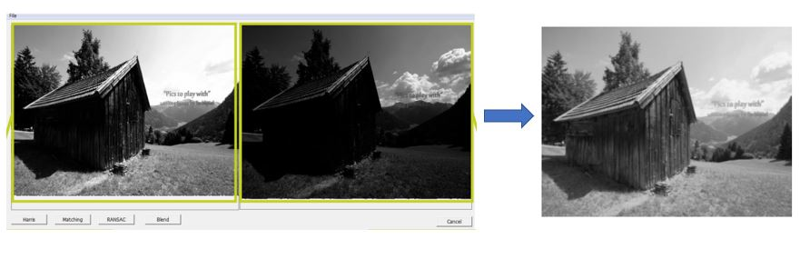

# HDRProject

- A program code that implements the HDR technique using two different focus images.

## Functions
1. Harris Corner Extraction
2. Image Mathcing
3. Image Blend

### Requirement
- C++, openCV, MFC
